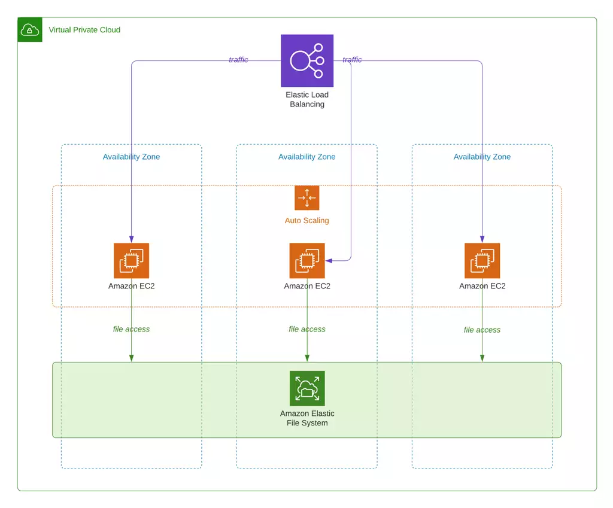

This initiative involves the implementation of a file system sharing solution utilizing AWS EFS. The objective is to establish an EFS 
and facilitate data sharing among various machines within the same region. This infrastructure will be developed using auto-scaling and 
an application load balancer, all orchestrated through Terraform.

### Architecture of elastic file system....

